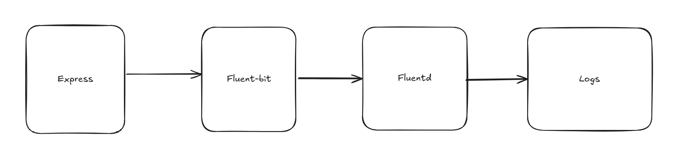

### Architecture


- Express App: Generates structured logs for API requests and application events
- Fluent Bit: Lightweight log forwarder that collects logs from the Express app
- Fluentd: Powerful log aggregator that processes and routes logs to different destinations


### Project Structure
```
project/
├── app/
│   ├── index.js         # Express application
│   ├── package.json     # Node.js dependencies
│   └── Dockerfile       # Docker image for the app
├── fluent-bit/
│   └── fluent-bit.conf  # Fluent Bit configuration
├── fluentd/
│   ├── fluent.conf      # Fluentd configuration
│   └── Dockerfile       # Custom Fluentd image
├── logs/                # Directory for log files
├── docker-compose.yml   # Docker Compose configuration
├── Makefile             # Convenience commands
└── README.md            # This file
```